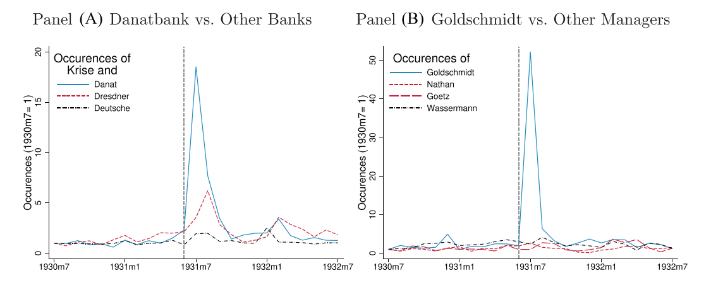
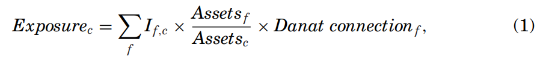
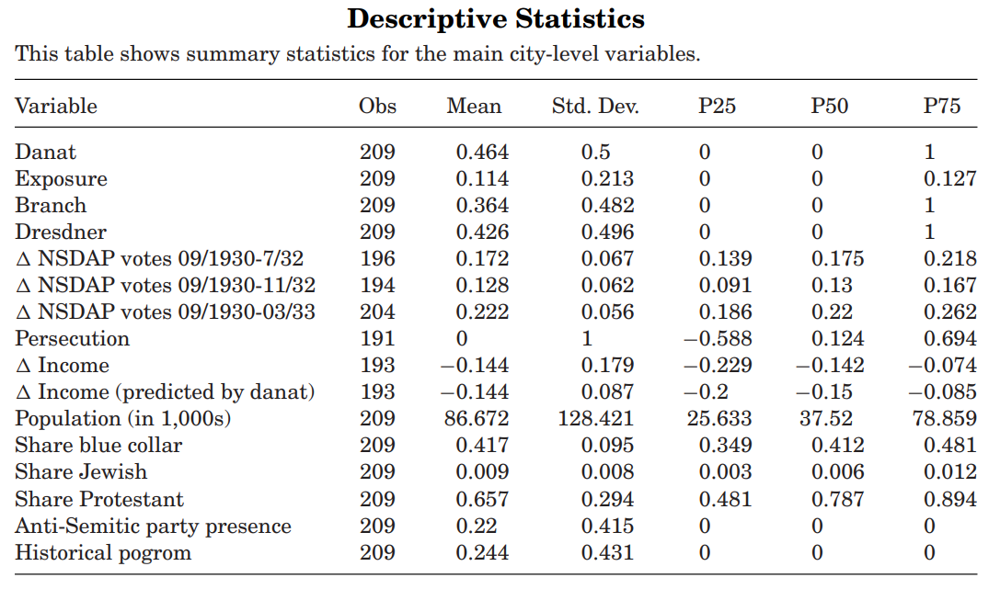
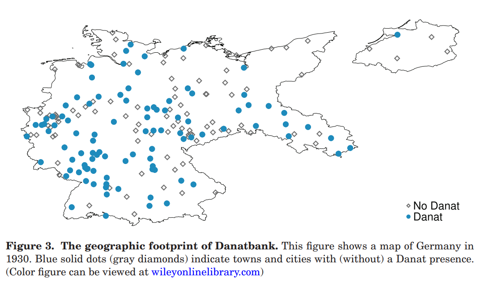
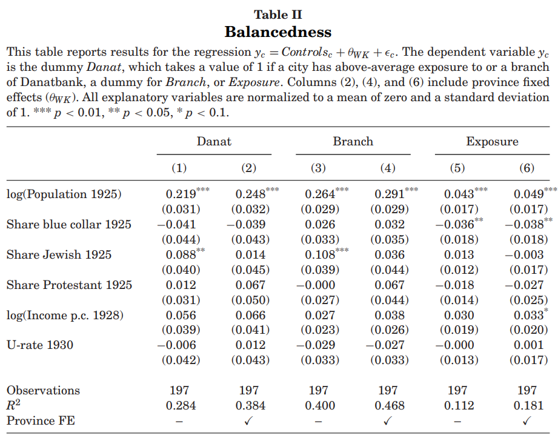
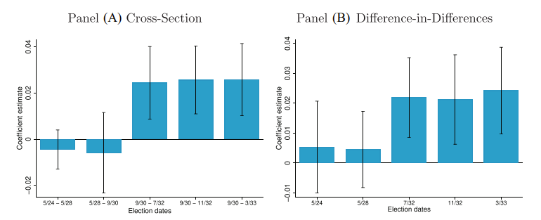
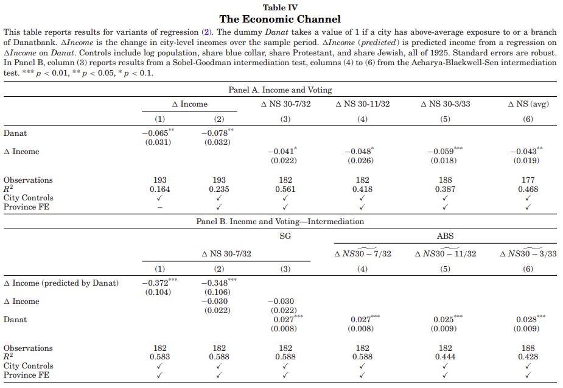
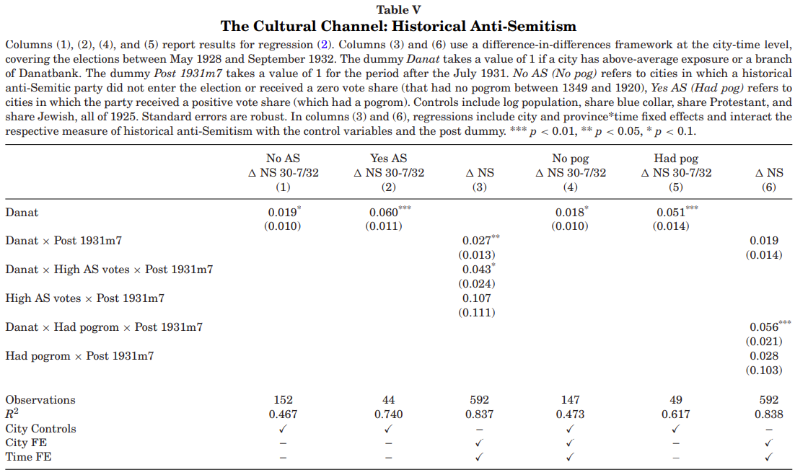
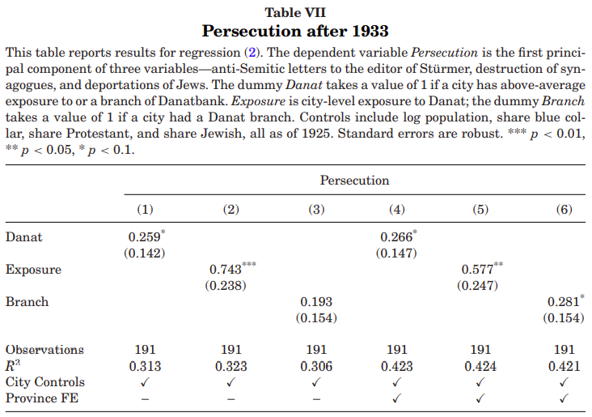
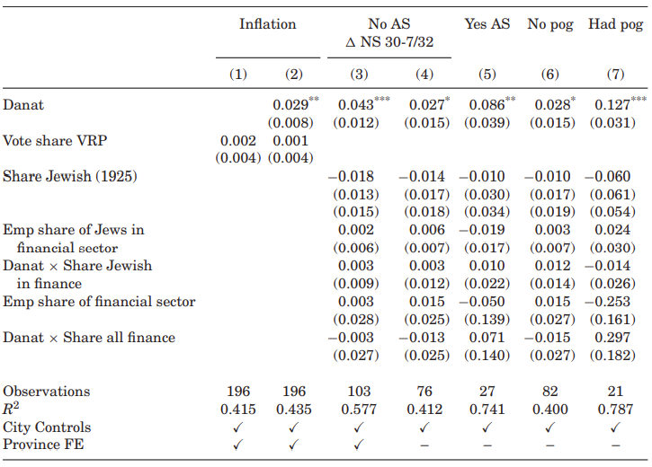

```{r setup, include=FALSE}
options(htmltools.dir.version = FALSE)
knitr::opts_chunk$set(
  fig.width=9, fig.height=3.5, fig.retina=3,
  out.width = "100%",
  cache = FALSE,
  echo = TRUE,
  message = FALSE, 
  warning = FALSE,
  hiline = TRUE
)
```

```{r xaringan-themer, include=FALSE, warning=FALSE}
library(xaringanthemer)
style_duo_accent(
  primary_color = "#A60F2D",
  secondary_color = "#4D4D4D",
  inverse_header_color = "#FFFFFF",
  # fonts
  header_font_google = google_font("Martel"),
  text_font_google = google_font("Lato"),
  code_font_google = google_font("Fira Mono")
)
```

```{r xaringan-panelset, echo=FALSE}
xaringanExtra::use_panelset()
```

```{r xaringan-scribble, echo=FALSE}
xaringanExtra::use_scribble()
```


## Agenda

### **Authors & Contributions**

### **Historical Background**

### **The Data & Main Variables**

### **Main Results**

### **Conclusions & Future Research**

---

class: inverse center middle, hide-logo

# Authors & Contributions

---

## Authors

.panelset[
.panel[.panel-name[Sebastian Doerr]

.left-column[
]

.right-column[

### Economist | Bank of International Settlements

- Monetary and Economic Department

- Works as part of the Innovation and the Digital Economy unit
  - Regulation of fintechs and cryptocurrencies, examines consequences of financial innovation for data privacy

]
]
.panel[.panel-name[Stefan Gissler]

.left-column[
]

.right-column[

### Principal Economist | The Federal Reserve

- Systemic Financial Institutions and Markets Section

- Research and Statistics Division

- Focuses on Financial Markets, Banking and Financial Institutions, and Economic History

]
]
.panel[.panel-name[José-Luis Peydró]

.left-column[
]

.right-column[

### Professor | Imperial College London

- Research interests span a wide range of factors affecting **the stability of the financial system including credit markets, capital and liquidity, financial contagion, FinTech and innovation in banking and financial services, and the globalisation of finance.**

- Focus on systemic risk, macroprudential policy, and the causes and impact of financial crises 

]
]
.panel[.panel-name[Hans-Joachim Voth]

.left-column[
]

.right-column[

### Professor | University of Zurich

- Principal areas of research include **long-run economic growth, the history of sovereign debt, causes and consequences of the Nazi Party's rise to power, economic history of the industrial revolution**

]
]
]

---

## Contributions

> "We show that the German banking crisis not only reduced output, but also had important political consquences, boosting the electoral fortunes of the Nazi party through both economic and noneconomic channels."

_These results suggest an important synergy between financial distress and cultural predispositions, with far-reaching and contemporary consequences._

.center[**This is "Mass Formation" not to be confused with an obedience to authority.**]

.center[]

---

class: inverse center middle, hide-logo

# Historical Background

---

layout: true

## Historical Background

---

### The Great Depression in Germany

.center[_The Great Depression in Germany ranked among the worst worldwide.  Peak to trough, German industrial output fell by 40% **(only surpassed in severity by the United States)._**]

- The Great Depression (in general) hit countries indebted to the United States the hardest

- Much of Germany's additional exposure came following the Treaty of Versailles 

- By 1933, one third of its workforce was unemployed

- Smoot-Hawley Tariff Act prevented (effectively) most German industries from trading in foreign markets

- From 1929 to 1933, German exports had declined by over 60%

---

### The Banking Crisis of 1931

> "When the scale of Danatbank's problems became public in July 1931, the ensuing bank run among retail depositers led to **a suspension of bank deposits, the failure of Danat and Dresdner Bank, a three-week bank holiday, and Germany's de facto exit from the gold standard.**"

.pull-left[
#### Danatbank

- Initial run began following rumors of insolvency of textiles
- Sparked what would become known as the "twin crisis," a fragile banking system faltering due to foreign withdrawals and a run on the Mark
- No evidence that Danatbank was laxer in its lending standards than other large banks

]

.pull-right[
#### Dresdner

- The largest bank in Germany (AUMs)
- Would ultimately be restructured in 1931
- Danatbank would merge with Dresdner

]

---

### The Rise of the Nazi Party

_Nazi propaganda exploited the 1931 banking crisis, which provided seemingly incontrovertible proof in support of their misguided theories of Jewish domination and destruction._ 

> Nazi propaganda led to a belief that "an ever-increasing convergence towards national socialist language and national socialist thought. The turning point came approximately during the summer crisis of 1931... the conflict between Germany's vital needs and those of the global economic and financial policy can no longer be obscured."  

- Between 1930 and March 1933 the Nazi's popular vote went from 18.3% to 43.9%

- In this same time, the Nazi party received the majority in parliament (37.4% more than Social Democrats and Communists combined)

- **Jakob Goldschmidt became a scapegoat for Germany's banking crises**

---

layout: false
class: inverse center middle, hide-logo

# The Data & Main Variables 

---

## The Data & Main Variables 

.panelset[
.panel[.panel-name[Data]

#### Data Sources
_"We collect data for the universe of German joint stock companies in 1929 to construct a measure of a municipality's exposure to Danatbank."_

- The Handbook of German Joint Stock Companies
- Annual compendium of balance sheet information (5,610 firms)
- In aggregate, the combined data sources account for 40% of GDP and two-thirds of all non-financial assets in 1929 



**German banks lent nationwide in the 1930s (unlike in the US)**, so the authors exploit cross-sectional variation in firms' and cities' precrisis exposure to banks to identify the effect of the banking crisis on voting.

]
.panel[.panel-name[Descriptive Statistics]
.pull-left[

]

.pull-right[

- In aggregate, this main data set contains information on 209 major German cities (population 20 million)

- The Nazi party's vote share increased by 17.2% on average between 1930 and July 1932

- The mean city had 86,700 inhabitants, 41.7% was 'blue collar'. Protestants made up 65.7% of the population, while Jews made up 0.9%

- In 22% of cities, anti-Semitic parties received votes before 1914, while 24.4% engaged in a pogrom at some point prior to 1929

- A Danat branch existed in 46.4% of cities

]
]
.panel[.panel-name[Geography]

.center[

]
]
.panel[.panel-name[Balancedness]

.pull-left[

]
.pull-right[

- Table II examines the balancedness of city-level covariates

- These are **multivariate regressions with _Danat, Branch, or Exposure_ as the dependent variable**

- Across specifications, **only population is consistently significant
  - The authors control for log population throughout their analysis
  
- Danat exposure is not systematically correlated with the share of blue-collar workers, percentage of Jews/Protestants, precrisis income per capita, or the unemploymment rate

]

]
]

---

class: inverse center middle, hide-logo

# Main Results

---

layout: true

## Main Results

---

### Danatbank & Nazi Voting


---

### Danatbank & Nazi Voting

---

### Economic Channel



---

### Economic Channel



---

### Cultural Channel



---

### Danat vs Dresdner


---

### Persecution after 1933



---

### Antifinance Sentiment



---

layout: false

class: inverse center middle, hide-logo

# Conclusions & Future Research

---

## Conclusions & Future Research 

> "What has been missing from the literature on the real effects of financial crises is **a clear link between financial distress and broad-based radicalization of the electorate"**

### Recap:

- The surge in Nazi voting was more pronounced in cities with a long history of anti-Semitism (Danat's presence added 6% to electoral gains)
- Exposure to Danat had a much stronger effect on Nazi voting - possibly reflecting Danat's Jewish chairman
- These results suggest a synergy between economic and cultural factors that propagate populism and fanatics

### Prospects:

- Néstor Kirchner - Argentina's '01 crisis
- U.S. Populism following '08 crisis - [FT Article](https://www.ft.com/content/687c0184-aaa6-11e8-94bd-cba20d67390c)
- How the '14 Russian Oil Crisis enabled the annexation of Crimea and the current invasion of Ukraine
