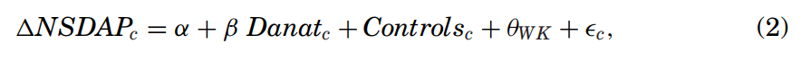
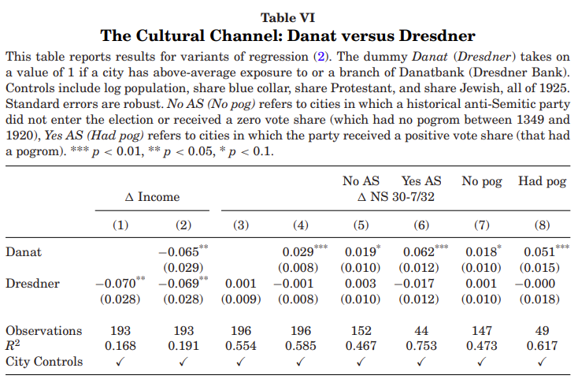

```{r setup, include=FALSE}
options(htmltools.dir.version = FALSE)
knitr::opts_chunk$set(
  fig.width=9, fig.height=3.5, fig.retina=3,
  out.width = "100%",
  cache = FALSE,
  echo = TRUE,
  message = FALSE, 
  warning = FALSE,
  hiline = TRUE
)
```

```{r xaringan-themer, include=FALSE, warning=FALSE}
library(xaringanthemer)
style_duo_accent(
  primary_color = "#A60F2D",
  secondary_color = "#4D4D4D",
  inverse_header_color = "#FFFFFF",
  # fonts
  header_font_google = google_font("Martel"),
  text_font_google = google_font("Lato"),
  code_font_google = google_font("Fira Mono")
)
```

```{r xaringan-panelset, echo=FALSE}
xaringanExtra::use_panelset()
```

```{r xaringan-scribble, echo=FALSE}
xaringanExtra::use_scribble()
```


## Agenda

### **Authors & Contributions**

### **Historical Background**

### **The Data & Main Variables**

### **Main Results**

### **Conclusions & Future Research**

---

class: inverse center middle, hide-logo

# Authors & Contributions

---

## Authors

.panelset[
.panel[.panel-name[Sebastian Doerr]

.left-column[
]

.right-column[

### Economist | Bank of International Settlements

- Monetary and Economic Department

- Works as part of the Innovation and the Digital Economy unit
  - Regulation of fintechs and cryptocurrencies, examines consequences of financial innovation for data privacy

]
]
.panel[.panel-name[Stefan Gissler]

.left-column[
]

.right-column[

### Principal Economist | The Federal Reserve

- Systemic Financial Institutions and Markets Section

- Research and Statistics Division

- Focuses on Financial Markets, Banking and Financial Institutions, and Economic History

]
]
.panel[.panel-name[José-Luis Peydró]

.left-column[
]

.right-column[

### Professor | Imperial College London

- Research interests span a wide range of factors affecting **the stability of the financial system including credit markets, capital and liquidity, financial contagion, FinTech and innovation in banking and financial services, and the globalisation of finance.**

- Focus on systemic risk, macroprudential policy, and the causes and impact of financial crises 

]
]
.panel[.panel-name[Hans-Joachim Voth]

.left-column[
]

.right-column[

### Professor | University of Zurich

- Principal areas of research include **long-run economic growth, the history of sovereign debt, causes and consequences of the Nazi Party's rise to power, economic history of the industrial revolution**

]
]
]

---

## Contributions

> "We show that the German banking crisis not only reduced output, but also had important political consquences, boosting the electoral fortunes of the Nazi party through both economic and noneconomic channels."

_These results suggest an important synergy between financial distress and cultural predispositions, with far-reaching and contemporary consequences._

.center[]

---

class: inverse center middle, hide-logo

# Historical Background

---

layout: true

## Historical Background

---

### The Great Depression in Germany

.center[_The Great Depression in Germany ranked among the worst worldwide.  Peak to trough, German industrial output fell by 40% (only surpassed in severity by the United States)._]

- The Great Depression (in general) hit countries indebted to the United States the hardest

- Much of Germany's additional exposure came following the Treaty of Versailles 

- By 1933, one third of its workforce was unemployed

- Smoot-Hawley Tariff Act prevented (effectively) most German industries from trading in foreign markets

- From 1929 to 1933, German exports had declined by over 60%

---

### The Banking Crisis of 1931

---

### The Rise of the Nazi Party

---

### Do Financial Crises Fan the Flames of Fanaticism?

---

layout: false
class: inverse center middle, hide-logo

# The Data & Main Variables 

---

## The Data & Main Variables 

.panelset[
.panel[.panel-name[Data]


]
.panel[.panel-name[Descriptive Statistics]


]
.panel[.panel-name[Geography]

.center[

]
]
.panel[.panel-name[Balancedness]


]
]

---

class: inverse center middle, hide-logo

# Main Results

---

layout: true

## Main Results

---

### Danatbank & Nazi Voting



---

### Danatbank & Nazi Voting

---

### Economic Channel


---

### Economic Channel


---

### Cultural Channel


---

### Danat vs Dresdner



---

### Persecution after 1933


---

### Antifinance Sentiment


---

layout: false

class: inverse center middle, hide-logo

# Conclusions & Future Research

---

## Conclusions & Future Research 

> "What has been missing from the literature on the real effects of financial crises is **a clear link between financial distress and broad-based radicalization of the electorate"**

### Recap:

- The surge in Nazi voting was more pronounced in cities with a long history of anti-Semitism (Danat's presence added 6% to electoral gains)
- Exposure to Danat had a much stronger effect on Nazi voting - possibly reflecting Danat's Jewish chairman
- These results suggest a synergy between economic and cultural factors that propagate populism and fanatics

### Prospects:

- Néstor Kirchner - Argentina's '01 crisis
- U.S. Populism following '08 crisis - [FT Article](https://www.ft.com/content/687c0184-aaa6-11e8-94bd-cba20d67390c)
- How the '14 Russian Oil Crisis enabled the annexation of Crimea and the current invasion of Ukraine
