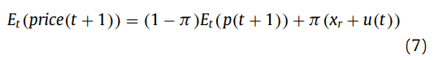

```{r setup, include=FALSE}
options(htmltools.dir.version = FALSE)
knitr::opts_chunk$set(
  fig.width=9, fig.height=3.5, fig.retina=3,
  out.width = "100%",
  cache = FALSE,
  echo = TRUE,
  message = FALSE, 
  warning = FALSE,
  hiline = TRUE
)
```

```{r xaringan-themer, include=FALSE, warning=FALSE}
library(xaringanthemer)
style_duo_accent(
  primary_color = "#A60F2D",
  secondary_color = "#4D4D4D",
  inverse_header_color = "#FFFFFF",
  # fonts
  header_font_google = google_font("Martel"),
  text_font_google = google_font("Lato"),
  code_font_google = google_font("Fira Mono")
)
```

```{r xaringan-panelset, echo=FALSE}
xaringanExtra::use_panelset()
```

```{r xaringan-scribble, echo=FALSE}
xaringanExtra::use_scribble()
```

## Agenda

### **Author & Motivation**

### **The Model**

### **Belief Formation & Market Behavior**

### **A Case Study of GameStop**

### **Conclusions & Further Directions**

---

class: inverse center middle, hide-logo

# Author & Motivation

---

## Author & Motivation

.panelset[
.panel[.panel-name[Lasse Heje Pedersen]

.pull-left[

]

.pull-right[

### Principal - AQR

- Also a finance professor at Copenhagen Business School and NYU
- Former Director of the American Finance Association
- Research interests focus on liquidity risk, asset prices, and investment management (liquidity risk models)
- Recent research includes:
  - "Big Data in Asset Pricing"
  - "Is There a Replication Crisis in Finance?" (w/Bryan Kelly)
  - **"Machine Learning and the Implementable Efficient Frontier" (Working Paper)**

]

]
.panel[.panel-name[Rational Agents]

### The DeGroot (1974) Model

- DeGroot proposed a model in which a group of _k_ individuals might reach a consensus on a common subjective probability distribution for some unknown parameter
  - DeGroot presents a model that describes how the group might reach agreement on a common subjective distribution by pooling their individual opinions (**people update their beliefs by listening to other people in their social network**)
  
- This method may be initially rational, **but the continued updating over multiple rounds of communication does not take into account that the same information may echo back many times** (DeMarzo et al., 2003)

- Most standard models assume that everyone behaves in this naive way, but Pedersen introduces "rational learners" into his model to capture the efffects of sophisticated professional investors/arbitrageurs


]
.panel[.panel-name[Social Bubbles]

> "When investors learn through their social network, they can disagree for extensive time periods, and their disagreement is time-varying and predictable based on the social network.  **The disagreement can generate a trading frenzy with a spike in turnover, high volatility, price momentum as a bubble builds, and a value effect as the bubble bursts."**

_Rational investors exploit network dynamics and may initially ride the bubble - eventually to be on reversal to fundamentals_

#### A New Anatomy of Bubbles (Kindleberger & Shleifer - 2000)

.center[]

]
.panel[.panel-name[Interpersonal Communications]

#### Prior Literature

**Shiller and Pound (1989) report survey evidence that "interpersonal communications are very important in investor decisions"**

- Shiller argues (2001) that "word-of-mouth communications, either _positive or negative_, are an essential part of the propagation of speculative bubbles" 
- Shiller also considered a standard epidemic model (2001) to capture this irrationality, discussing how people can "infect" each other with an investment idea 
- Hiershleifer (2020) considers a time-varying infection rate ("buzz"), and calls for a greater focus on social interaction in finance

#### This Paper

_"My model shows how inter-personal communication can spread the intra-personal judgment biases documented in this literature."_ 

]
]

---

class: inverse center middle, hide-logo

# The Model

---

## The Model

.panelset[
.panel[.panel-name[Asset and Signals]

The economy has _N_ investors who communicate with each other and trade an asset in discrete time indexed by _t = 0, 1, 2,...,_

- Supply of shares is given by _s_
- Its fundamental value is given by _v + u(t) ∈ R_, where _u(t)_ is a publicly observed random walk and _v_ is an unobserved random variable that investors try to learn about
- The random walk has innovations with a constant variance, _σ^2u = Var(u(t) − u(t − 1))_

At time 0, each person _i_ starts with a signal about the value _v_ given by the random variable _xi(0) = vi_, which gives each agent a **useful, but incomplete, piece of information about _v_**

- Collectively, all agents have full information about _v_ 
- Each weight, _Ki_, is a measure of the importance of agent _i's_ signal
- The unobserved value, _v_, is revealed each time period with probability _π_, such that when _v_ is revealed, the price equals its total value,  _v + u(τ)_

]
.panel[.panel-name[Naive and Rational Learning]

> The economy consists of people with two methods of paying attention, "rational learners" and boundedly-rational ones ("naive").  **Each naive learner _i_ selectively follows a subset of people that s/he views as most informative or most entertaining, and s/he uses the same method for updating each round.**

The naive learner uses the row vector _Ai_ such that their view in the next time period becomes (1) where the network is characterized by _A_.


Because Pedersen also considers rational learners, a rational learner _i_ listens to everyone in the first round of communciation.  Based on these views, the rational learner updates their view to _xi(1) = xr_ such that the rational view _xr_ is given by (2).


]
.panel[.panel-name[Portfolios and Prices]

> Trading starts at time 1, after the first round of communication.  

>At any time _t_ after the value of _v_ has been revealed, the price equals the commonly known total value.  Before revelation, the endogenous price at time _t_ is denoted by _p(t)_, so price equals:

.center[]

.pull-left[

Maximizing the utility (5) with a risk given, the investor's optimal portfolio is now: 


_The asset demand varies in the perceived price sensitivity, agent wealth, duration, and risk._

]
.pull-right[

The expected price next period is the average of the price without and with revelation:


The demand of any short term investor:

]

]
.panel[.panel-name[Four Types of Agents]

> The economy has four types of agents who communicate to learn about an asset that they are trading:

.left-column[

#### Naive Investors

#### Fanatics

#### Rational Long-term Investors 

#### Rational Short-term Investors

]

.right-column[


]

]
]

---

class: inverse center middle, hide-logo

# Belief Formation & Market Behavior

---

## Belief Formation & Market Behavior

.panelset[
.panel[.panel-name[Proposition 1]

.pull-left[

#### Echo Chambers

> The following proposition shows that the hardheaded views dominate over time as these opinions continue to "echo" through the population.

- The first part of the proposition **shows how the naive agents are initially influenced by each other (rational and fanatic views)**
- The second part shows how the naive investors end up with views that are a mixture of fanatic and rational views, _xh_

]
.pull-right[


]

]
.panel[.panel-name[Proposition 2]

.pull-left[

#### Influencer Value

> The communication of naive agents still matters, **because this communication determines the thought leadership of various fanatic and rational views.**

_The intuition behind this result is that hardheaded agents become thought leaders due to their commitment to their views, but influencers are not committed to any particular view._

]
.pull-right[


]

]
.panel[.panel-name[Proposition 3]

.center[]

The rational price, _pr(t)_, is the expected fundamental value, _xr+u(t)_, less a risk premium that depends on the supply of shares _(s)_, the fundamental risk, _σ_, the speed of revelation, _(π)_, and the aggregate wealth of investors _(w)_.  

]
.panel[.panel-name[Proposition 4]

.pull-left[

#### Network Effects

> The rational price is a useful benchmark when considering the equilibrium price in the presence of naive investors and fanatics.  **The general price also depends on the average view among naive investors and fanatics, weighted by their wealth.**

]
.pull-right[


]

]
.panel[.panel-name[Proposition 5/6]

.pull-left[

#### Fanatic Effects

> This proposition shows that a naive agent can affect the price by elevating the thought leadership of a fanatic.  **This effect is naturally larger if the naive agent has a greater influencer value.**

_Propositions 4-6 show that price deviates more from the rational price when **(i) a larger fraction of wealth is held by the fanatic or naive; (ii) fanatic views are more extreme; (iii) fanatics have higher thought leadership because more naive people listen to them.**_ 

]
.pull-right[


]

]

.panel[.panel-name[Proposition 7]

.center[]

]
.panel[.panel-name[Proposition 8/9]

.pull-left[


]
.pull-right[

#### Momentum and Volatility


]

]
]

---

class: inverse center middle, hide-logo

# A Case Study of GameStop

---

## A Case Study of GameStop

.panelset[
.panel[.panel-name[Gamified Trading]

]
.panel[.panel-name[Volume, Volatility, and Interest]

]
.panel[.panel-name[Figure 4]

.center[]

]
.panel[.panel-name[Link to the Model]

]
]

---

class: inverse center middle, hide-logo

# Conclusions & Further Directions

---

## Conclusions & Further Directions

### Recap

_The model can help explain a number of observed phenomena like **social network effects in portfolio holdings, excess volatility, momentum and reversal effects, meme trading, the effects of repeated news, and spillover of expectations and transaction prices across people with social links.**_

_Belief formation via social networks may both affect the normal day-to-day fluctuations in asset prices and the extreme events connected to bubbles and crashes._

--

### Future Research

> "If social network effects are a force behind pervasive dynamics throughtout global equity... such as value, momentum, and excess volatility, then the GameStop affair is only the tip of the iceberg, a very extreme tip that is currently seen more clearly than the part hidden under the surface."  