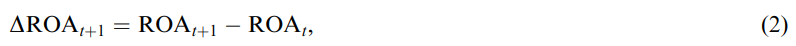
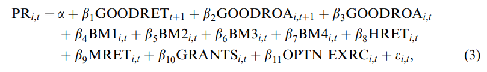
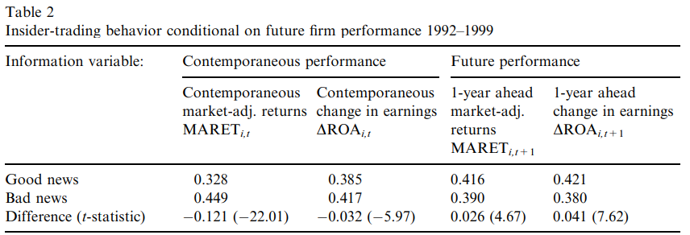
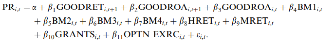
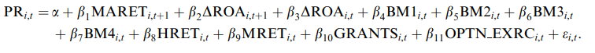
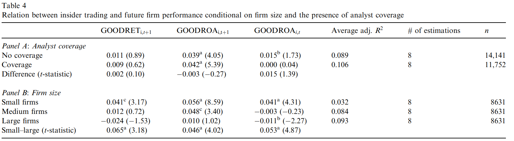
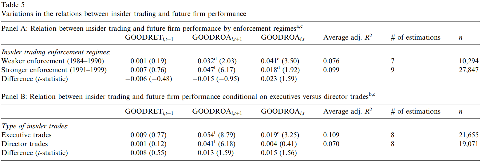

```{r setup, include=FALSE}
options(htmltools.dir.version = FALSE)
knitr::opts_chunk$set(
  fig.width=9, fig.height=3.5, fig.retina=3,
  out.width = "100%",
  cache = FALSE,
  echo = TRUE,
  message = FALSE, 
  warning = FALSE,
  hiline = TRUE
)
```

```{r xaringan-themer, include=FALSE, warning=FALSE}
library(xaringanthemer)
style_duo_accent(
  primary_color = "#A60F2D",
  secondary_color = "#4D4D4D",
  inverse_header_color = "#FFFFFF",
  # fonts
  header_font_google = google_font("Martel"),
  text_font_google = google_font("Lato"),
  code_font_google = google_font("Fira Mono")
)
```

```{r xaringan-panelset, echo=FALSE}
xaringanExtra::use_panelset()
```

```{r xaringan-scribble, echo=FALSE}
xaringanExtra::use_scribble()
```

# Agenda

### Motivation

### Dichotomization of Insider Trading

### Data & Research Design

### Primary Results

### Conclusion

---

class: inverse center middle, hide-logo

# Motivation

---

## Motivation

### Mixed Results in Prior Literature 

- Givoly and Palmon (1985 - 10b5, 1935 Securities Exchang Act) are unable to document a link between insider trading profits and subsequent disclosure events.

- Noe (1999 - clustered voluntary disclosure) finds trading patterns to be unrelated to forecasted earnings news.

- Ke et al. (2003 - technical default) find managers of distressed firms to 'dump then pump' rather than 'pump and dump'

- **Rozeff and Zaman (1998) looks at investor overreaction and insider purchasing of value and growth stocks**

  - Piotroski and Roulstone mirror much of Rozeff and Zaman's methodology

---

class: inverse center middle, hide-logo

# Dichotomization of Insider Trading

---

layout: true 

## Dichotomization of Insider Trading

---

### What is meant by 'contrarian'?

> A person who opposes or rejects popular opinion, especially in stock exchange dealing

**The definition of contrarian, in a broad sense, is inherently ambiguous** 

- In journalism, it's characterized by articles and books making counterintuitive claims
- In science, it refers to those who challenge a scientific consensus
- In investing, it refers to individuals speculating against movements and sentiments of most investors

_"Insider can earn excess profit by either recognizing pricing errors made by outsider or by having superior knowledge about future cash flow realizations."_


---

> In both settings, insider trades help push prices towards fundamental value.

.pull-left[

### Contrarian Beliefs

"In the former case, insider trade against current investor sentiment, recognizing that outsiders make valuation errors through the application of inferior valuation models and/or the incorporation of biased judgements."  

- Prior research supports the hypothesis that insider are contrarian traders. Rozeff and Zaman (1998)
- Prior research does not disentangle the source of insiders' superior trading performance.

]

.pull-right[

### Superior Information

"In the latter case, managers have private information about the patter of future cash flows.  Because prices respond to unexpected changes in cash flow, insider trade when their private knowledge of future performance and payoffs differs from current market expectations." 

- Prior research examined and supported the belief that insiders trade on the basis of superior future cash flow information, three to nine quarters before an earnings break. Ke et al. (2003)

]

---

layout: false

class: inverse center middle, hide-logo

# Data & Research Design

---

layout: true

## Data & Research Design

---

### Firm's Purchase Ratio




_The number of shares purchased/sold by the registered insiders (top executives and directors - Rozeff and Zaman) of firm **i** during fiscal year **t**._

---

### Firm's Return on Assets


_The primary measure of future earnings news is **t+1's** annual earnings innovation.  Here ROAt equals net income before extraodordinary items (scaled by average total assets). ROA assumed to be unbiased market representation._


---

### Rozeff & Zaman (1998)



_These univariate tests, however, fail to separate out the effects of trading against misvaluation and trading with superior future information._

- _GOODRET_ equals total market return
- _GOODROA_ equals positive earnings performance/earnings innovation
- _HRET_ and _MRET_ equal 1 if the 12-month market adjusted return is in the top and middle third of sample firms, respectively
- _GRANTS_ equal the number of shares granted to insiders
- _OPTN-EXRC_ equals the number of options exercised by insiders

---

### Empericial timeline

####Fig 1(Next) illustrates, conceptually, the empirical timeline of insider trading.

- For each firm-year observation, a purchase ratio is measured for firm _i_ over fiscal year _t_

- Contemporaneous and future firm performance is measured over fiscal year _t_ and _t+1_ respectively

- FYE denotes fiscal year end for year _t_

- EA denotes the announcement of year _t's_ annual earnings innovation _ROAi,t_

---

layout: false
class: center, hide-logo
background-image: url("img/timeline.png")
background-size: contain

---

layout: false

class: inverse center middle, hide-logo

# Primary Results

---

layout: true

## Primary Results

---

### Univariate Relations 



---

### Multivatiate Solutions

.panelset[
.panel[.panel-name[Panel A]

]
.panel[.panel-name[Panel B]

]
.panel[.panel-name[Column (5)]

> "To corroborate the preceding results and control for ommitted performance variables, we estimate a full model (estimation (5)) that includes all three performance metrics"

- Consistent with insiders trading on superior knowledge about future earnings innovations, period _t+1_ earnings innovation is positively associated with purchase activities _after_ controlling for future returns and contemporaneous earnings news

- This trading-earnings relation is distinct from the BM and contemporaneous return relations documented by Rozeff and Zaman

- These estimations _are_ consistent with Ke et al. (2003) that insiders capitalize on both outside investors' valuation errors and their own superior information

- The low incremental R-squareds associated with the inclusion of future cash flows news suggests that trading on the basis of superior knowledge is less important than trading on the basis of misvaluation/contrarian belief

]
]

---

layout: false
class: center, hide-logo
background-image: url("img/tab3.png")
background-size: contain

---

layout: true

## Primary Results

---

### The Order of Results

> First, univariate tests are run to confirm insider trading.  Second, a multivariate test is run (albiet mathematical intensive) that supports the idea of contrarian beliefs.  Last, they examine cross sectional differences to determine if inter-temporal shifts in insider trading laws and intra-firm differences in the access to information are associated with systematic variation in the observed insider trading-earnings relation.

_Next,_

#### "Relation between insider trading and future performance across analyst and firm size portfolios"


#### "Variation in the costs of trading on future information"

---

### Analyst's and Firm Size

.panelset[
.panel[.panel-name[Analyst Coverage]


]
.panel[.panel-name[Firm Size]


]
.panel[.panel-name[Table 4]



]
]


---

### Variation in Risk and Reward

.panelset[
.panel[.panel-name[Enforcement Regimes]


]
.panel[.panel-name[Executive/Director]


]
.panel[.panel-name[Table 5]



]
]

---

## Future Earnings and BM Ratio

> "Rozeff and Zaman (1998) document that insider purchase ratios are positively related to the firm's book-to-market ratio and conclude that insiders recognize the market's over-reaction to past good and bad news and trade accordingly, i.e., insiders are contrarians."  

- This is predicated on the insider's recognition of market mispricing.
 - Half of all value firms experience negative returns in year _t+1_, so a strict book-to-market strategy does not indicate efficient insider trading.
 
- If insiders use their private information about future earnings to differentiate between over-valued and under-valued securities, the relation between insider trading and future **earnings innovations** should be robust across all book-to-market portfolios.  

Table 3 documented a weak positive relation between PR _i,t_ and contemporaneous earnings innovations. After controlling for a firm’s BM ranking, we find the relation between insider trading and contemporaneous earnings performance depends on the firm's book to market ratio. 

---

layout: false
class: center, hide-logo
background-image: url("img/tab6.png")
background-size: contain

---

layout: false

class: inverse center middle, hide-logo

# Conclusion

---

layout: false

## Conclusion


