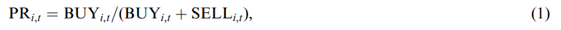
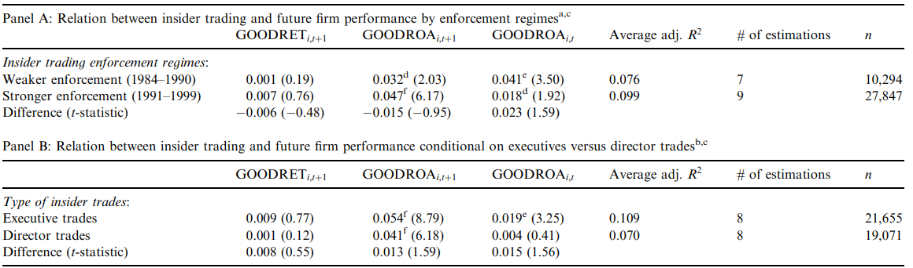

```{r setup, include=FALSE}
options(htmltools.dir.version = FALSE)
knitr::opts_chunk$set(
  fig.width=9, fig.height=3.5, fig.retina=3,
  out.width = "100%",
  cache = FALSE,
  echo = TRUE,
  message = FALSE, 
  warning = FALSE,
  hiline = TRUE
)
```

```{r xaringan-themer, include=FALSE, warning=FALSE}
library(xaringanthemer)
style_duo_accent(
  primary_color = "#A60F2D",
  secondary_color = "#4D4D4D",
  inverse_header_color = "#FFFFFF",
  # fonts
  header_font_google = google_font("Martel"),
  text_font_google = google_font("Lato"),
  code_font_google = google_font("Fira Mono")
)
```

```{r xaringan-panelset, echo=FALSE}
xaringanExtra::use_panelset()
```

```{r xaringan-scribble, echo=FALSE}
xaringanExtra::use_scribble()
```

# Agenda

### Motivation

### Dichotomization of Insider Trading

### Data & Research Design

### Primary Results

### Conclusion

---

class: inverse center middle, hide-logo

# Motivation

---

## Motivation

### Mixed Results in Prior Literature 

- Givoly and Palmon (1985 - 10b5, 1935 Securities Exchang Act) are unable to document a link between insider trading profits and subsequent disclosure events.

- Noe (1999 - clustered voluntary disclosure) finds trading patterns to be unrelated to forecasted earnings news.

- Ke et al. (2003 - technical default) find managers of distressed firms to 'dump then pump' rather than 'pump and dump'

- **Rozeff and Zaman (1998) looks at investor overreaction and insider purchasing of value and growth stocks**

  - Piotroski and Roulstone mirror much of Rozeff and Zaman's methodology

---

class: inverse center middle, hide-logo

# Dichotomization of Insider Trading

---

layout: true 

## Dichotomization of Insider Trading

---

### What is meant by 'contrarian'?

> A person who opposes or rejects popular opinion, especially in stock exchange dealing

**The definition of contrarian, in a broad sense, is inherently ambiguous** 

- In journalism, it's characterized by articles and books making counterintuitive claims
- In science, it refers to those who challenge a scientific consensus
- In investing, it refers to individuals speculating against movements and sentiments of most investors

_"Insider can earn excess profit by either recognizing pricing errors made by outsiders or by having superior knowledge about future cash flow realizations."_


---

> In both settings, insider trades help push prices towards fundamental value.

.pull-left[

### Contrarian Beliefs

"In the former case, insider trade against current investor sentiment, recognizing that outsiders make valuation errors through the application of inferior valuation models and/or the incorporation of biased judgments."  

- Prior research supports the hypothesis that insider are contrarian traders. Rozeff and Zaman (1998)
- Prior research does not disentangle the source of insiders' superior trading performance.

]

.pull-right[

### Superior Information

"In the latter case, managers have private information about the pattern of future cash flows.  Because prices respond to unexpected changes in cash flow, insiders trade when their private knowledge of future performance and payoffs differs from current market expectations." 

- Prior research examined and supported the belief that insiders trade on the basis of superior future cash flow information, three to nine quarters before an earnings break. Ke et al. (2003)

]

---

layout: false

class: inverse center middle, hide-logo

# Data & Research Design
#### Thomson Financial First Call Insiders Data

---

layout: true

## Data & Research Design

---

### Firm's Purchase Ratio




_The number of shares purchased/sold by the registered insiders (top executives and directors - Rozeff and Zaman) of firm **i** during fiscal year **t**._

- To be comparable with Rozeff and Zaman (1998), data is restricted to open-market transaction and does not include firm-years without these

---

### Firm's Return on Assets


_The primary measure of future earnings news is **t+1's** annual earnings innovation.  Here ROAt equals net income before extraodordinary items (scaled by average total assets). ROA assumed to be unbiased market representation._

- Ample evidence in prior literature links insider trading to future returns, but returns represent noisy measure of this information set

- Neither insiders ex ante nor researches ex post can perfectly predict or explain how market expectations change

- The authors presume insiders should observe financial performance signals before other investors - next year's earnings influence stock prices (Ball and Brown, 1968) 


---

### Rozeff & Zaman (1998)


_These univariate tests, however, fail to separate out the effects of trading against misvaluation and trading with superior future information._

- _GOODRET_ equals positive total market return indicator variable
- _GOODROA_ equals positive earnings performance/earnings innovation indicator variable
- _HRET_ and _MRET_ equal 1 if the 12-month market adjusted return is in the top and middle third of sample firms, respectively
- _GRANTS_ equals the log of one plus the % ratio of the sum of the number of options and shares of restricted stock granted to the firm's insiders during year _t_ to total shares outstanding at FYE
- _OPTN-EXRC_ equals the log of one plus the % ratio of the number of options exercised by the firm's insiders during year _t_ to total shares outstanding at FYE

---

### Empericial timeline

####Fig 1(Next) illustrates, conceptually, the empirical timeline of insider trading.

- For each firm-year observation, a purchase ratio is measured for firm _i_ over fiscal year _t_

- Contemporaneous and future firm performance is measured over fiscal year _t_ and _t+1_ respectively

- FYE denotes fiscal year end for year _t_

- EA denotes the announcement of year _t's_ annual earnings innovation _ROAi,t_

---

layout: false
class: center, hide-logo
background-image: url("img/timeline.png")
background-size: contain

---

layout: false

class: inverse center middle, hide-logo

# Primary Results

---

layout: true

## Primary Results

---

### Univariate Relations 

> Table 2 presents basic univariate relations between firm performance and insider buying. Consistent with prior research, it documents that managers are more likely to purchase securities during periods of falling stock prices.


---

### Multivatiate Solutions

.panelset[
.panel[.panel-name[Panel A]


- Panel A uses these same indicators variables 

- Column (1) confirms the previously documented contrarian relations between purchase ratios and the firm's past returns (HRET and MRET) and book-to-market ratios (BM1-BM4)

- Insider purchases are inversely related to contemporaneous 12-month returns and positively related to the firm's book-to-market ranking

]
.panel[.panel-name[Panel B]


- Panel B estimates coefficients using measures of future/continuous performance

- Estimations (2)-(4) examine the incremental association between future firm performance and insider purchasing behavior (terciles)

- Consistent with the unconditional results in Table 2, both GOODROA _t+1_ and GOODRET _t+1_ are positively associated with insider purchasing behavior 

]
.panel[.panel-name[Column (5)]

> "To corroborate the preceding results and control for ommitted performance variables, we estimate a full model (estimation (5)) that includes all three performance metrics"

- Consistent with insiders trading on superior knowledge about future earnings innovations, period _t+1_ earnings innovation is positively associated with purchase activities _after_ controlling for future returns and contemporaneous earnings news

- This trading-earnings relation is distinct from the BM and contemporaneous return relations documented by Rozeff and Zaman

- These estimations _are_ consistent with Ke et al. (2003) that insiders capitalize on both outside investors' valuation errors and their own superior information

- The low incremental R-squareds associated with the inclusion of future cash flows news suggests that trading on the basis of superior knowledge is less important than trading on the basis of misvaluation/contrarian belief

]
]

---

layout: false
class: center, hide-logo
background-image: url("img/tab3.png")
background-size: contain

---

layout: true

## Primary Results

---

### The Order of Results

> First, univariate tests are run to confirm insider trading.  Second, a multivariate test is run (albiet mathematical intensive) that supports the idea of contrarian beliefs.  Last, they examine cross sectional differences to determine if inter-temporal shifts in insider trading laws and intra-firm differences in the access to information are associated with systematic variation in the observed insider trading-earnings relation.

_Next,_

#### "Relation between insider trading and future performance across analyst and firm size portfolios"


#### "Variation in the costs of trading on future information"

---

### Analyst's and Firm Size

.panelset[
.panel[.panel-name[Preface]

> "We partition the sample by two variables that are correlated with a firm's information environment: the presence of analyst coverage and firm size."

- An insider's ability to trade on future performance is inversely related to the informational efficiency of the firm's stock price

- The more quickly _and_ completely a firm's stock price reflects shifts in firm level, industry, and/or macro-economic factors, the less opportunity for an insider to profit

]
.panel[.panel-name[Analyst Coverage]

> "We measure analyst coverage as whether or not at least one analyst filed a 1-year ahead earnings forecast on I/B/E/S during fiscal year _t_... In our sample, 45.4% of the firm-year observations had analyst coverage."

- The presence of an active analyst community _and_ its pressure on management to disclose forward-looking financial information leads to a richer and more accurate information environment (Lang & Lundholm, 1993)

- So long as analysts' information acquisition, synthesis, and dissemination attenuate the manager's information advantage, the potential for insider trading on future performance weakens


]
.panel[.panel-name[Firm Size]

- Firm size is also correlated with the strength of the firm's information environment

> "Large firms tend to be heavily followed by the investment community and most information-based anomalies are attenuated for large firms."

- Moreover, current annual earnings information is impounded into prices earlier in the fiscal year for large firms vis-à-vis small and mid-size firms 

_We expect the relation between insider trading and future earnings to be inversely related to the firm's size._


]
.panel[.panel-name[Table 4]


]
]


---

### Variation in Risk and Reward

.panelset[
.panel[.panel-name[Preface]

> "Aside from potential variation in legal and political costs associated with differences in firm size and monitoring intensity, it is difficult to measure _ex ante_ firm-level differences in the cost of trading on future earnings information."

A crude solution:

_Differentiating between 'low enforcement' and 'high enforcement' periods_

- Prior to the current sample period, Congress passed the Insider Trading and Securities Fraud Enforcement Act (1988) and the Securities Enforcement Remedies and Penny Stock Reform Act (1990) 

- To test the effectiveness of these deterents, the trading data is expanded to between 1984 and 1999

- Most importantly, GOODROA _t+1_ is significantly larger than the coefficient on current earnings news

]

.panel[.panel-name[Enforcement Regimes]

.pull-left[

#### Insider Trading and Securities Fraud Enforcement Act

- This specifically targeted insider trading actions, it provided for fines up to three times the profit an offender made as a result of the inside information

]

.pull-right[

#### Securities Enforcement Remedies and Penny Stock Reform Act 

- This amended the Securities Act of 1933 more broadly, and it introduced prohibitions in management and board membership

]

]
.panel[.panel-name[Executive/Director]

> "Our insider-trading metric combines the open-market transactions of registered executives and directors; as such, all of our tests implicitly assume that executives and directors have similar access to firm-specific information." 

- It is important to separate the board of directors as governing body from active executive management

- Here, the coefficient on GOODROA _t+1_ is larger in magnitude for executives than directors (marginally statistically significant)

- More importantly, the lack of positive relation between director trades and current earnings news is consistent with the predicated belief that their delayed receipt of information inhibits their ability to trade on insider information

]
.panel[.panel-name[Table 5]



]
]

---

## Future Earnings and BM Ratio

> "Rozeff and Zaman (1998) document that insider purchase ratios are positively related to the firm's book-to-market ratio and conclude that insiders recognize the market's over-reaction to past good and bad news and trade accordingly, i.e., insiders are contrarians."  

- This is predicated on the insider's recognition of market mispricing.
 - Half of all value firms experience negative returns in year _t+1_, so a strict book-to-market strategy does not indicate efficient insider trading.
 
- If insiders use their private information about future earnings to differentiate between over-valued and under-valued securities, the relation between insider trading and future **earnings innovations** should be robust across all book-to-market portfolios.  

Table 3 documented a weak positive relation between PR _i,t_ and contemporaneous earnings innovations. After controlling for a firm’s BM ranking, we find the relation between insider trading and contemporaneous earnings performance depends on the firm's book to market ratio. 

---

layout: false
class: center, hide-logo
background-image: url("img/tab6.png")
background-size: contain

---

layout: false

class: inverse center middle, hide-logo

# Conclusion

---

layout: false

## Conclusion

> Existing research has separately shown that insiders trade on the basis of contrarian beliefs (Rozeff and Zaman, 1998) and on the basis of superior knowledge about future cash flow news (e.g., Ke et al., 2003) 

- Strong evidence is presented that insider purchases are positively related to future earnings performance, positively related to book-to-market ratios, and inversely related to past returns

- Each of these has incremental explanatory power for insider purchases, suggesting that insiders trade on the basis of both contrarian beliefs _and_ private information about future cash flow news

- It seems that superior information about future cash-flow changes explains a smaller portion of insider purchase activities than do proxies for security misvaluation

> This paper does not explicitely examine the profitability of insider trades or the cost/benefit of insider trades on various horizons


> It is difficult to completely account for issues of endogeniety, particularly reverse causality 


