```{r setup, include=FALSE}
options(htmltools.dir.version = FALSE)
knitr::opts_chunk$set(
  fig.width=9, fig.height=3.5, fig.retina=3,
  out.width = "100%",
  cache = FALSE,
  echo = TRUE,
  message = FALSE, 
  warning = FALSE,
  hiline = TRUE
)
```

```{r xaringan-themer, include=FALSE, warning=FALSE}
library(xaringanthemer)
style_duo_accent(
  primary_color = "#A60F2D",
  secondary_color = "#4D4D4D",
  inverse_header_color = "#FFFFFF",
  # fonts
  header_font_google = google_font("Martel"),
  text_font_google = google_font("Lato"),
  code_font_google = google_font("Fira Mono")
)
```

```{r xaringan-panelset, echo=FALSE}
xaringanExtra::use_panelset()
```

```{r xaringan-scribble, echo=FALSE}
xaringanExtra::use_scribble()
```

## Selection

.pull-left[
### Spring '22

- Cyber risk and the U.S. financial system: A pre-mortem analysis
- Common Risk Factors in Cryptocurrency
- Is Bitcoin Really Untethered?

### Summer '22 Literature

- Central Bank Digital Currency and Banks 
- Artificial Intelligence in Finance
- Machine learning at central banks
]
.pull-right[
### Summer '22 Peer Reviewed 

- Availability, recency, and sophistication in the repurchasing behavior of retail investors
- Political Capital and Moral Hazard
- The customer knows best: The investment value of consumer opinions 
- Do Shocks to Personal Wealth Affect Risk-taking in Delegated Portfolios 

### Interests & Future Research
]

---

class: inverse center middle, hide-logo

# Spring '22

---

layout: true

## Cyber risk and the U.S. financial system

---

### Data & Methodology

"**We model how a cyber attack may be amplified through the U.S. financial system**, focusing on the wholesale payments network."

- All data come directly from the Fedwire (restricted)

- Compromising functions include confidentiality, **availability**, and **integrity** (all resulting in direct losses, reputational costs, **spillover effects**, and **bank runs**)

- Through all _a priori_ simulations, the ability of a bank to service running creditors may be impaired
  - Financial diversity and uncertainty could spark runs on uncompromised operations of the respective bank
  
  - May be further complicated through asymmetric information (information disclosure)

---

### The Fedwire

.center[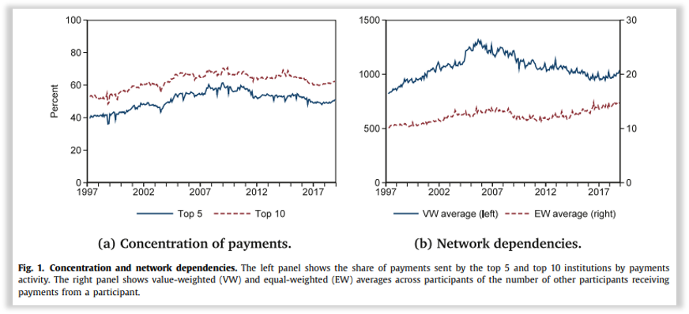]

---

### Results & Conclusions

> Authors estimate that spillovers of **an attack on one of the five most active banks would impair 31% of the network**, on average (some days being significantly worse). 

#### Alternative scenarios: 

- Other banks respond with liquidity hoarding, **forgone payment activity could reach more than 2.5 times daily GDP**.  

- Reverse stress tests also show attacks on groups of **small banks** could impair a significant amount of the network.  

- Additionally, third-party providers and financial market utilities pose additional risks
  - Clearing House Interbank Payment System (CHIPS) or Continuous Linked Settlement (CLS) alongside other FMUs may impair liquidty of big banks that are not attacked
  
- The Fed sees payment flows without purpose, so they are unable to predict how this may impact borrowers and the 'real economy'

---

layout: true

## Common Risk Factors in Cryptocurrency

---

### Data

> "When we started our study, _Coinmarketcap.com_ listed both active and defunct cryptocurrencies, thus alleviating concerns about survivorship bias."


**Restrictions:**
1,827 coins in total 
1. Daily close prices to construct weekly coin returns from 2014-2020
1. Coins must have price, volume, and mkt cap (>$1,000,000)
1. Only exchanges with public APIs (no DeFi)
  - 109 coins in 2014
  - 1,559 coins in 2018
  - 665 coins in 2020
  - 1,446 coins (September 9th, 2022)

---

### Methodology

.pull-left[

**A New 3-Factor Model**

Principal Component Analysis: 
- PC1 strongly correlates with the cryptocurrency size factor
- PC2 is significantly exposed to the cryptocurrency momentum factor 
- These two account for 45% of the variation

A reduction from 24 to 10 characteristics that are statistically significant

**Followed FF 1993 2X3 sorts **

]

.pull-right[

**CMKT** (Cryptocurrency Market Factor)
- Value-weighted return of all cryptos and U.S. T-Bill

**CSMB** (Cryptocurrency Size Factor)
- Accounts for mkt cap, price, max day price, price volume, and stdev of price volume

**CMOM** (Cryptocurrency Momentum Factor)
- Accounts for one-week, two-week, three-week, four-week, and one-to-four week momentum strategies

]

---

### Results & Conclusions

.panelset[
.panel[.panel-name[Size as a Proxy]

> A common critique of cross-sectional trading strategies... **studies show that the size effect in the equity market is weak outside of the original Banz (1981) sample.** 

2 Points:
1. Size may proxy for an illiquidity premium
1. The tradeoff between capital gains and the convenience yield: in equilibrium, **the convenience yield of larger and more mature cryptocurrencies is higher, and thus their capital gain should be lower** (Sockin and Xiong, 2018)

Smaller coins have lower prices and higher illiquidity, relative to larger coins.  The CSMB is greater among coins that have higher arbitrage costs. In the time series, CSMB is higher at times of high market volatility

**The CSMB is significantly and positively exposed to stdev of crypto market returns**, suggesting that the CSMB performs well in a more volatile market (supporting the liquidity view of the size premium)
]
.panel[.panel-name[Momentum Effect]
> "We find that cryptocurrency momentum effect is strong at relatively short horizons" (<1 Month)

Following the behavioral underreaction channel, momentum should be stronger among assets that receive less attention
- Long-short momentum strategy in the below-median size group generates insignificant weekly returns
- Long-short strategy in the above-median size group generates statistically significant 3.2% weekly returns

CMOM is more pronounced among coins with high attention as proxied by trading volume (assuming accurate volume estimates)
- In contrast to equity markets, potentially too much uncertainty

]
.panel[.panel-name[Conclusions]
_"This paper shows that the cross-section of cryptocurrencies can be meaningfully analyzed using standard asset pricing tools."_ 

While the authors provide evidence to support some plausible mechanisms behind the CSMB and CMOM effects, these channels are only plausible explanations.

This market is still very young, and **there is no guarantee that these results will hold in the future** (2022 Bust)

Still, these results **may act as a proxy to other new/emerging asset classes** that may come into existence in the future

]]

---

layout: true

## Is Bitcoin Really Untethered?

---

### Data & Methodology

.panelset[
.panel[.panel-name[Data]
.pull-left[
All Pricing Data comes from CoinAPI.io

> "Ironically, new large entities have gained centralized control over the vast majority of operations in the cryptocurrency world, such as centralized exchanges that handle the majority of transactions and **stable coin issuers that can control the supply of money like a central bank.**"

**iFinex > Bitfinex > Tether**

]

.pull-right[
.center[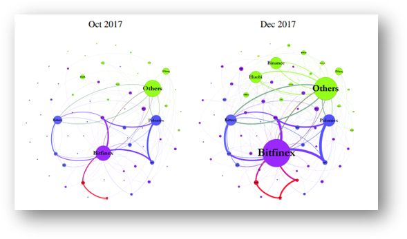]
]

]
.panel[.panel-name[Methodology]

#### Pushed 

Tether's price relative to the USD may increase as a consequence of strong investor demand, and Tether may also be driven by its usefulness as a facilitator of **cross-exchange arbitrage** to eliminate pricing discrepancies across cryptocurrency exchanges.

#### Pulled

If Tether issuers are trying to provide stability to the market during downtourns, outflows of Tether and purchases of Bitcoin by Bitfinex may follow periods of negative Bitcoin returns.  Bitcoin returns may show a return reversal after negative returns.  If tether is not fully backed by USD/Euro at the outset, but issuers want to signal otherwise to investors by releasing EOM accounting statements, then Tether creators may liquidate Bitcoins into USD to demonstrate sufficient reserves.

]
]

---

### Results and Conclusions

.panelset[
.panel[.panel-name[High-flow Events]
.pull-left[
.contain[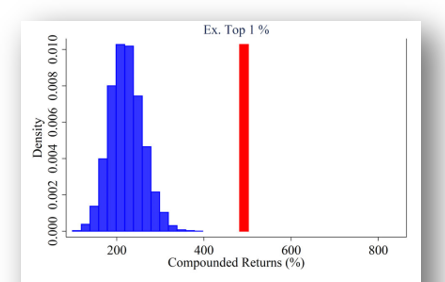]
]
.pull-right[

- When removing the top 5% and 10% of hours (volume), returns are 67.2% and 79.2% lower, respectively
- A monte-carlo simulation excluding these highest hours returns just 221% (March 1, 2017 - March 31st, 2018) buy-and-hold

**Replacing these top 1% of hours with other randomly selected hours, none of the 10,000 simulations return close to this actual return.**

]

]
.panel[.panel-name[1LSg]

.pull-left[

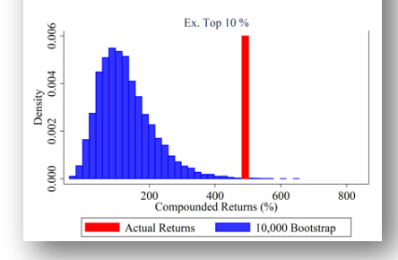
]
.pull-right[

Remember the single player scenario? 1LSg received over half of all Bitcoin flows on Bitfinex exchange (March 1, 2017 - March 31, 2018)

_"The high 1LSg flow hours are the top 1% of hours with high 1LSg flows,"_ which similarly follows with the top 5% and 10% of 1LSg flows. 

Note: For the net Tether/Bitcoin flows associated with the other five main Tether-based exchanges (Binance, HitBTC, Huobi, Kraken, and OKEx), **removing the top 1%, 5%, and 10% of flows has no effect on simulated Bitcoin prices.**

]
]
.panel[.panel-name[Conclusions]

The authors established that one large player on Bitfinex uses Tether to purchase large amounts of Bitcoin when prices increase following the printing of Tether **(consistent with the supply-driven hypothesis)**.

> "More broadly, these findings also suggest that innovative technologies designed to bypass traditional banking systems have not eliminated the need for external surveillance, monitoring, and a regulatory framework." 

Following this papers publication, the State of New York Office of the Attorney General ordered Bitfinex and Tether to pay $18.5 million (nominal relative to some other recent SEC crackdowns)

_"Bitfinex and Tether recklessly and unlawfully covered-up massive financial losses to keep their scheme going and protect their bottom lines."_

.pull-right[(AG Letitia James)]

]
]

---

layout: false

class: inverse center middle, hide-logo

# Summer '22 Peer Reviewed

---

layout: true

## Availability, recency, and sophistication in </br> the repurchasing behavior of retail investors

---

### Data & Methodology

.panelset[
.panel[.panel-name[Data]

Data is composed of 1.9 million trades made by approximately 80,000 households between January 1991 to November 1996.  

> Individual investor trading data at a large discount borkerage house indicates that repurchasing is a fairly pervasive behavior, with about **40% of all households making at least one repurchase**. These 'repurchasing households' account for **nearly 80% (848,388 trades) of the total number and nearly 90% ($10.55 billion) of the value of all stock purchases at this brokerage house**.  

]
.panel[.panel-name[Methodology]

The authors construct **probit regressions with dummy variables for various stocks and investor characteristics** (e.g., profit, size, extreme_ret, tech_stk) in an attempt to test repurchased stocks for characteristics that might proxy for a high degree of attention and test for types of investors who engage in repurchases.  

There were marginally significant investor preferences for repurchasing stocks previously sold for a profit along with repurchasing stocks that were in the previous day's highest-return decile, **but the most significant result was the recency effect.**  

_With regard to diversification, investors who repurchase more often tend to have less-diversified portfolios._

]
]
---

### Results and Conclusions

Retail investors face time and information constraints, causing them to use cognitive shortcuts and heuristics.  **Investors will use readily available information and repurchase stocks that are touted in the news or stocks in which they previously made a profit** - _a gambler's mindset._

Investors display a preference for repurchasing stocks with large positive returns on the previous day and a few large-cap stocks in a few industries.  Of the repurchases, 36% are in the technology sector and about 14% are in the pharmaceutical and retail sectors.  **These stocks are easy for investors to recall because of wide analyst coverage, heavy advertising, and/or news headlines.**

_Nofsinger concludes that the recency of a trade plays a significant role in the repurchase decision and this behavior is suboptimal and associated with less sophisticated investors._

---

layout: true

## Political Capital and Moral Hazard

---

### Data & Methodology

#### This paper examines how political connections affect risk exposure of financial institutions.

.panelset[
.panel[.panel-name[Data]

_"The population for this study consists of all financial firms (SIC codes 6000-6999) trading on the NYSE, AMEX, and Nasdaq from 1973-2009... American Depository Receipts (ADRs), Real Estate Investment Trusts (REITs), foreign-based firms, close-end funds, etc. are excluded (CRSP codes of 10 or 11)."_ 

Databases:

.pull-left[
- Official Congressional Directory
- OpenSecrets (lobbying data)
- Boardex 
]
.pull-right[
- Compustat
- CRSP
- Thomson Financial
- HUD
]
]
.panel[.panel-name[Methodology]
.pull-left[
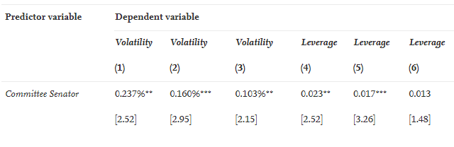
]
.pull-right[
- Column 1 represents the coefficient on _Committee Senator_
- Column 2 includes firm and industry controls
- **The average stock volatility in this sample is about 3%, so having a home senator on the Banking Committee increases an average firm's risk by about 5% to 8%.**
]
]
.panel[.panel-name[Senate Banking Committee]

- Jurisdiction includes **banking, financial markets, securities, international trade and finance, and economic policy**
- Confirm heads of executive departments and government agencies (e.g., Treasury, the Federal Reserve, and the SEC)
- Senators have additional leverage over government officials because they advise and consent power to confirm these officials
- Most domestic financial institutions operate within state boundaries (e.g., United Bank of Iowa)
- **Resolute** - Avoid issues with census restructuring and movement around representatives

]
]

---

### Results & Conclusions

_"The critical component of the economic mechanism of moral hazard is the rational belief or expectation by market participants of outside intervention in adverse states of the world."_

- Moral hazard has been a staple of economic theory since the 1960s, **but economists know little about how firm incentives are affected by potential future government intervention.**
- In the sample from 1973 - 2009, the author finds a **positive relationship between political connections and risk taking**, as measured by stock volatility and/or leverage ratios
- In a more narrow sample, the author finds that politically connected firms had higher leverage prior to the 2008 financial crisis and increased their leverage more in response to local housing price growth
  - **But** they were also less likely to go bankrupt or go insolvent during and after the financial crisis **and** had higher stock returns during this crisis
  
There have been a number of new campaign finance laws and court rulings in the last decade (_Citizens United v. Federal Election Commission_)
- How do these impact corporate campaign expenditures?
- How do these findings impact industries like defense (Senate Armed Services Committee) and health care (Senate Health, Education, Labor, and Pensions Committee)

---

layout: true 

## The customer knows best: <br> The investment value of consumer opinions 

---

### Data & Methodology

> July 2004 - December 2015, 14.5 million customer reviews of 270,000 different products were posted on Amazon.com

- Huang looks at panel data from 346 public firms (primarily business equipment, consumer nondurables, and manufacturing)
  - This sample is considerably larger than prior literature with similar methodology
  
- Baseline financial data comes from CRSP, Compustat, and I/B/E/S 

- Panel data covers firm months, with each month having at least 10 reviews and, on average, including 150 stocks

- Regressions assess the determinants of the abnormal ratings - examining the ratings' investment value, their predictive effect for future returns, and their status as new information applying Fama-Macbeth tests
---

### Results & Conclusions

_**Consumer opinions are shown to provide new value-relevant information for stock investing via analysis of millions of customer product reviews posted on Amazon.com** - this return predictability holds over time, remains after controlling for firm characteristics, and can signal revenue and earnings surprises._

- A spread portfolio constructed to purchase stocks with abnormal favorable customer ratings in the top tercile and selling stocks in the bottom tercile **generates and abnormal monthly return of 55bps to 73 bps**
  - These ratings may positively predict revenue and earnings surprises and net purchases by **hedge fund managers**

- These results are **concentrated among stocks in less efficient market sectors** (small cap/low analyst coverage)

- **Anecdotal evidence says that customer postings are curated online, particularly by smaller companies striving to gain attention via fictitious reviews**
---

layout: true 

## Do Schocks to Personal Wealth Affect Risk-taking in Delegated Portfolios 

---

### Data & Methodology

> "Using exogenous wealth shocks stemming from the collapse of the housing market, we show that managers who experience substantial losses in their home values subsequently reduce risk in their delegated funds."

_If managers' risk preferences change following a negative shock to personal wealth, they may reduce risk-taking in the delegated fund simply to reduce the risk of their personal portfolios._

- Data comes from a merged CRSP-Morningstar panel, resulting in 5,146 fund-manager pairs as of the fourth quarter 2006
  - Housing data comes from Zillow

- A personal leverage ratio for managers is given by collecting mortgage information from the LexisNexis Public Records database

---

layout: false

### Results & Conclusions

.pull-left[

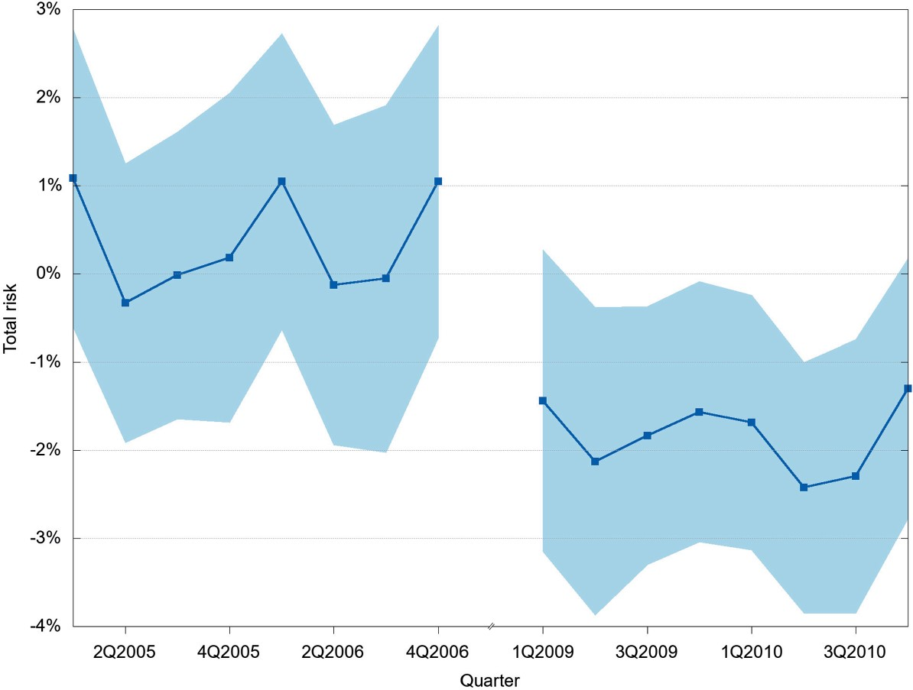
]
.pull-right[
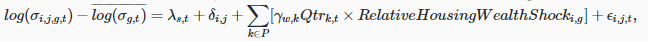
- The figure shows coefficient estimates and standard errors from the OLS estimation of a difference-in-differences regression, **using quarterly, manager-fund observations of active U.S. domestic equity mutual funds**
- _RelativeHousingWealthShock_ is an indicator variable if the city-adjusted housing wealth change is less than the median sample
- Risk is measured as the quarterly standard deviation of daily fund returns
]

---

layout: false

class: inverse center middle, hide-logo

# Summer '22 Literature

---

layout: true

## Central Bank Digital Currency and Banks 

---

### Data & Methodology 

> "We show that CBDC need not reduce bank lending unless friction and synergies bind deposits and lending together... Our counterfactual analysis shows that a **CBDC can replace a significant fraction of bank deposits, especially when it pays interest.**"

.panelset[
.panel[.panel-name[Deposits & Lending]

- Even assuming a 'quality discount', (Table 3) suggests that when CBDC is introduced, it competes with bank deposits and results in lower deposit shares for banks
- Assuming non-interest-bearing CBDC, more yield-sensitive households will be more likely to deposit with banks
- CBDC influences banks' funding structure, **banks need to substitute their lost deposits with more expensive wholesale borrowings**
- Assuming banks substitute deposits with wholesale funding, one dollar increase in CBDC reduces bank lending by 34 cents
- If the Fed pays an interest rate that equals the current federal funds rate, the interest-bearing CBDC will be able to capture an additional 30% of the deposit market

]
.panel[.panel-name[Monetary Policy]
.pull-left[
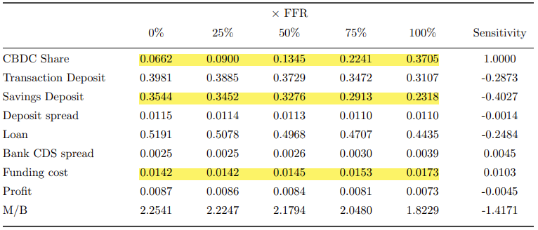
]
.pull-right[
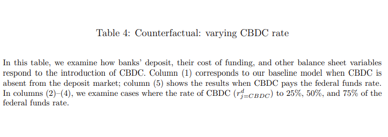
]
]
.panel[.panel-name[Bank Funding]
.pull-left[
_"Our analysis shows that the introduction of CBDC can significantly impair the attractiveness of bank deposits and lead to outflows of deposit funding."_

As banks' external financing cost starts to increase, **banks will cut their loan provisions further because they now face higher costs to replace the  lost deposit funding.**

]
.pull-right[
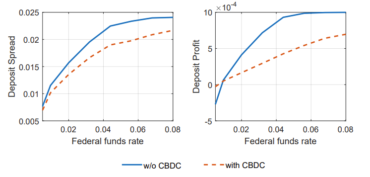
]
]
.panel[.panel-name[Big v. Small]
.pull-left[
"There is large heterogeneity in banks' external financing frictions across the size distribution."

- Banks in the top one percentile as big banks (the rest small)
- Smaller banks face particularly high frictions in accessing the wholesale funding market
- Big banks are able to rely on their wholesale funding access to replace lost deposits
]
.pull-right[
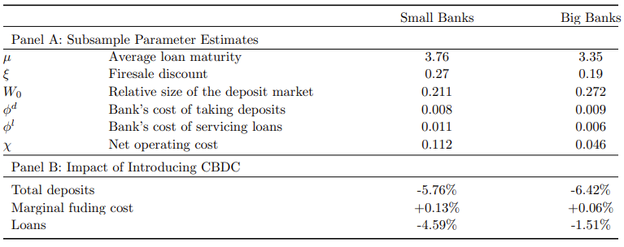
]
]
]

---

### Counterfactuals & Conclusions

> "We first clarify an important conceptual issue underlying many extant debates about CBDC, that is, **CBDC need not to reduce bank lending _unless frictions and synergies bind deposits and lending together._"**

- Evaluating the potential impact of CBDC on bank lending is effectively an evaluation of magnitudes of these frictions and synergies

  - CBDC could replace a significant fraction of bank deposits, especially when it pays interest
  
  - However, CBDC would have a much smaller impact on bank lending because banks could replace a large fraction of the lost deposits with wholesale funding (big banks)
  
  - This also may cause banks' funding costs to be more sensitive to short-term rates, **increasing their exposure to interest rate risk**

---

layout: true 

## Artificial Intelligence in Finance

---

### Motivation & Methodology 

.panelset[
.panel[.panel-name[Growth of AI]

> As a group of related technologies that include machine learning (ML) and deep learning (DL), AI has the potential to disrupt and refine the existing financial services industry.
> .pull-right[-Bonnie Buchanan]

- Between 2012 and 2016, the US invested $18.2 billion into AI compared with $2.6 billion in China and $850 million in the UK

- Recently, the US has lost its global AI equity deal share, decreasing from 77% to 50% of equity deal share during the last five years

- China has overtaken the US for the number of AI patents over the last five years
  - Concentrated in Beijing, Guangdong, and Shanghai

]
.panel[.panel-name[China v. US]
.pull-left[
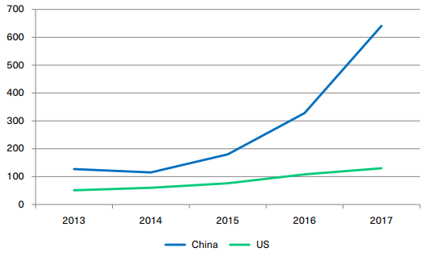
]
.pull-right[
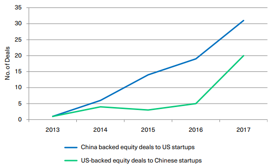
]
]
.panel[.panel-name[AI in Financial Services]

.pull-left[
_Outside of the technology sector, **the financial services industry is the biggest spender on AI services** and is experiencing very fast growth._

Fraud detection and compliance: 
- "Benford's Law" is one of the easiest ways to detect fraud; it runs an analysis on the first digits in a given dataset (Pipl/Okta)
]
.pull-right[
Banking chatbots and robo-advising:
- "JP Morgan's [AI technology] can review approximately 12,000 documents in a matter of seconds... a human would spend 360,000 hours on the same documents" (Brummer and Yadav, 2019)

Algorithmic trading:
- AT strategies - _signal processing, market sentiment, news reader, pattern recognition_
]
]

.panel[.panel-name[Unsupervised Learning]

> Unsupervised ML is defined as **a system that learns without needing human assistance** and 'labelled' data to teach it

- This is most helpful as in text, image, or very high-dimensional data

- Often can be used as a first step in data analysis

- _clustering algotirhms, dimension reduction, feature extraction, and topic models_

- **Company Name Standardization**

]
.panel[.panel-name[Supervised Learning]

_Supervised learning is the case where the chosen algorithm tries to fit the target using the given input features._ 

- There is a training and testing set, with an accuracy percentage (**Company Name Standardization**)

- _predictive analytics, random forests, neural networks, LASSO_

]
]

---

### Policy-making & Conclusions

> "The technology underpinning Fintech is also fuelling a spinoff known as RegTech, which aims to make compliance and regulatory activities easier, faster, and more efficient." 

- Hong Kong Stock Exchange (tech used by NASDAQ) to detect stock manipulation and market abuses
  - Analyses historical trading activity to identify patterns and anomalies, finding dramatic stock price swings and rises in trading volume
  
- [DERA](https://www.sec.gov/news/speech/bauguess-big-data-ai) at the SEC aims to find cases of potential fraud via ML in massive regulatory datasets

- Prior to the 2008 financial crisis, **ratings agencies used algorithmic assessments of creditworthiness to rate mortgage backed securities.** (Dodd Frank now requires agencies to disclose methodologies)

- This still isn't tangible, but it makes researchers feels better

---

layout: true 

## Machine learning at central banks

---

### Case Studies

> "We present three case studies relevant to central bank policy, financial regulation, and economic modelling more widely." 

.panelset[
.panel[.panel-name[Banking Supervision]
.pull-left[
"Regular close scrutiny of banks' balance sheets has become a standard for financial supervisors following the financial crises.  However, the manual inspection of hundreds or thousands of firms records' can be inefficient."
- Using naıve Bayes, k-NN, decision tree, SVM, and random forests

]
.pull-right[
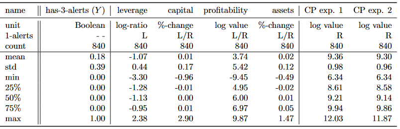
]
]
.panel[.panel-name[UK CPI Inflation]

"We use a simple framework for consumer price index **(CPI) inflation forecasting on a medium-term horizon of two years.**"

All data is publicly available in the UK, and all approaches will be based on a lead-lag model where the target variable CPI inflation leads to changes or the level of other variables (features) by two years.

.pull-left[
All data are utilized in both training and testing sets of random forests (for both pre-crisis and post-crisis)

Sources: BoE, ONS, BIS, World Bank
]
.pull-right[
- CPI prices
- debt(s)
- employment(s)
- income(s)
- inflation rate(s)
- external(s)
]

]
.panel[.panel-name[Fintech Unicorns]

_Using clustering analysis of the universe of investor-firm funding for technology firms, a shortlist of potentially high-success firms in fintech is found._

- A central bank (given the centrality of the financial sector in contemporary economies) should try to anticipate and be prepared for the economic shocks that may arise from new entrants (Uber, Airbnb, Digital Currencies)
- Using CrunchBase database (1960 - 2015)

.pull-left[
**4 Features for _a priori_ clustering**:
]
.pull-right[
1. The amount of money raised/year
1. Average number of funding rounds/year
1. Average number of individual investors/year
1. Average score of investors (prior investors)
]
]
]

---

### Summary & Conclusions

> "As for the analogy of cooking, the successful design of a learning system depends on the combination of the right ingredients as well as the experience of the chef."

#### An Important Note

- An increasing quantity of **granular micro or high-frequency data** are becoming available to central banks and regulators, including **single asset holdings and transactions of financial institutions, individual household portfolios and consumption behaviours, firms' investment and hiring strategies, payments data, etc.**

#### Potential Drawbacks

1. **The difference between causal inference and prediction**, where ML tools often ignore the issue of endogeneity
1. **The interpretability of many techniques**, where a model's parameters or outputs cause confusion ('black boxes' in neural networks)
1. **The modelling of time**, where an ignorance arises in cross-sectional approaches

---

layout: false

class: inverse center middle, hide-logo

# Interests and Future Research

---

## Interests and Future Research
#### Potential Papers
- Payoff complementarities and financial fragility: Evidence from mutual fund outflows (JFE, 2022)
- Predictably Unequal? The Effects of Machine Learning on Credit Markets (JF, 2022)
- A theory of financial media (JFE, 2021)
- Bitcoin's limited adoption problem (JFE, 2022)
- A quantitative model of dynamic moral hazard (Forthcoming, RFS) 
- Listening in on investors' thoughts and conversations (JFE, 2021)
- Growth forecasts and news about monetary policy (JFE, 2022) 

.pull-left[
#### Research Topics
- Financial Fragility & Crisis
- Emerging Asset Classes & Pricing
- Moral Hazard
- Behavioral Finance/Investor Behavior
- ML/AI/Sentiment Analysis/Fuzzy Trace Theory/NLP/MMT
]
.pull-right[
#### Research Ideas 
- Sentiment Analysis on Social Media (Buy/Sell following Elon - "The Customer Knows Best")
- Effects of 'stable coins' - particularly 'algorithmic stable coins' and their impact on other currencies
- SWIFT alternatives - Cryptocurrencies, DeFi, and central banks' adoption of different digital payment systems
- Influences of Influencers on Investor Behavior
]
