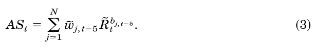

```{r setup, include=FALSE}
options(htmltools.dir.version = FALSE)
knitr::opts_chunk$set(
  fig.width=9, fig.height=3.5, fig.retina=3,
  out.width = "100%",
  cache = FALSE,
  echo = TRUE,
  message = FALSE, 
  warning = FALSE,
  hiline = TRUE
)
```

```{r xaringan-themer, include=FALSE, warning=FALSE}
library(xaringanthemer)
style_duo_accent(
  primary_color = "#A60F2D",
  secondary_color = "#4D4D4D",
  inverse_header_color = "#FFFFFF",
  # fonts
  header_font_google = google_font("Martel"),
  text_font_google = google_font("Lato"),
  code_font_google = google_font("Fira Mono")
)
```

```{r xaringan-panelset, echo=FALSE}
xaringanExtra::use_panelset()
```

```{r xaringan-scribble, echo=FALSE}
xaringanExtra::use_scribble()
```


# Agenda

### Motivation

### Database

> ### Performance-Decomposition Methodology
>
> ### Empirical Findings

### Conclusion

---

class: inverse center middle, hide-logo

# Motivation

---
layout: true

## Motivation

---

### Why

#### For Me


- A year of mutual fund research
- An interest in regulation and compliance

_Risk Shifting and Mutual Fund Performance (Huang, Sialm, and Zhang - 2009)_

--

#### For Wermers

> "Do mutual fund managers who actively trade stocks add value?" 


> "These studies (Gruber, 1996 and Carhart, 1997) do not provide a promising picture of active mutual fund management-instead, the studies conclude that investors are better off, on average, buying a low-expense index fund. Yet, investors continue to pour money into actively managed funds in pursuit of performance." 


---

### What

> "In this paper, we employ a new database that allows a comprehensive look at the performance of the mutual fund industry at both the stock holdings level and the net returns level.  **With this database, we empirically decompose performance into several components to analyze the value of active fund management.**"

--

The author decomposes mutual fund performance into several components (methodology) to provide a categorical analysis of the magnitude of returns and the costs of active versus passive management.

- stock-picking ability
- timing of the stock picking
- stock attributes
- fund transaction costs
- fund expense ratio
- net return to shareholders

---
layout: false
class: inverse center middle, hide-logo

# Database

---
layout: false

## Database

.panelset[

.panel[.panel-name[CDA]
#### CDA Investment Technologies

_Quarterly portfolio holdings for all U.S. equity mutual funds existing at any time between January 1, 1975, and December 31, 1994._

The CDA data set lists:

- The equity portion of each fund's holdings (i.e., the shareholdings of each stock held by that fund) 
- The total net assets under management for each fund
- The self-declared investment objective
 - "aggressive growth"
 - "growth"
 - "growth and income"
 - "income"
 - "balanced"

]
.panel[.panel-name[CRSP]
#### CRSP NYSE/AMEX/Nasdaq

**All stock prices and returns are obtained from the CRSP NYSE/AMEX/Nasdaq stock files.**

.pull-left[
It is worth noting that the author highlights how Carhart (1997) also used the CRSP data in his analysis - much of this paper builds off Carhart's previous work.
]
.pull-right[
The CRSP database contains monthly data on net returns and annual data on portfolio turnover and expense ratios for all mutual funds existing at any time between January 1, 1962 and December 31, 1997.   
]

]
.panel[.panel-name[Diversification]

#### Almost all Funds are Included 

> "Both of the source databases are free of survivorship bias - the merged database is also essentially free of survival bias, as almost every diversified equity mutual fund in the two source databases is included in the merged dataset." 

The goal of this research is (over-simplified) to compare mutual-fund performance with index-fund performance, so the author aims his focus on funds seeking growth and income, but does not restrict to any industries, liquidity levels, or percentage-stock funds:

> "In this study, we limit our analysis to funds that generally hold diversified portfolios of U.S. equities." 

**Excluded funds include _international funds_, _bond funds_, _gold funds_, _real estate funds_, and all _other sector funds_ (which generally hold and trade minimal quantities of domestic equities, if any).**


]
.panel[.panel-name[Summary Statistics]
.pull-left[
#### Panel A 
- The number of funds in the merged database that exist (complete record)
- The average yearly net return, weighted by the total net assets (TNA)
- Quarterly buy-and-hold net returns to each fund, regardless of whether that fund survives the entire year (minimizes survival requirements)
- The TNA-averaged quarterly returns are compounded into yearly returns
- The proportion of the market value of all U.S. equities (CRSP) held by these funds increased from ~5% to ~11% (Chen et al., 2000)
]
.pull-right[
#### Panel B
- Mutual funds began offering different classes of shares in a single mutual fund 
- Shows the growth of these shareclasses in the 90s 

#### Panel C
- Presents the average asset allocation in stocks (versus bonds, cash, etc.)
- A breakdown of the author's mutual fund universe into the investment objectives
- Keep in mind the dismal performance of cash and bonds during this time period (~83% invested in equities by 1994)
]
]
]

---

class: center, hide-logo
background-image: url("img/tab1a.png")
background-size: contain

---

class: center, hide-logo
background-image: url("img/tab1b.png")
background-size: contain

---


class: inverse center middle, hide-logo

# Performance-Decomposition Methodology

---

layout: false

## Performance-Decomposition Methodology

.panelset.sideways.right[

.panel[.panel-name[CS]
#### The Characteristic Selectivity (CS) Measure 


_The portfolio-weighted return on stocks currently held by the fund, in excess of returns on matched control portfolios having the same style characteristics (selectivity)._

- _Wj_ is the portfolio weight on stock _j_ at the end of quarter _t-1_
- _Rj_ is the quarter _t_ buy-and-hold return on stock _j_
- _Rt_ is the quarter _t_ buy-and-hold return of the characteristic-based benchmark portfolio that matched _j_

]
.panel[.panel-name[CT]
#### The Characteristic Selectivity (CT) Measure 


_The portfolio-weighted return on control portfolios having the same characteristics as stocks currently held by the fund, in excess of time-series average returns on those control portfolios (style timing)._

- The former stock-selectivity measure does not capture the ability of the fund manager to time the various stock characteristics.
- A.k.a the "tilting" of portfolio weights
- Variables are the same, but highlighting times _t-1_ and _t-5_

]
.panel[.panel-name[AS]
#### The Average Style (AS) Measure 



_The time-series average returns on control portfolios having the same characteristics as stocks currently held (long-term style-based returns)._

- Each stock held by a fund at the end of _t-5_ is matched with its characteristic-based benchmark
- The quarter _t_ return of this benchmark portfolio is multiplied by the portfolio weight 
- This is then summed over all stocks held at _t-5_
- This lag eliminates returns due to timing of characteristics

]
.panel[.panel-name[Transaction Costs]
#### Transaction Costs, Stoll (1995)


The total cost of executing a **purchase** of stock _i_ during quarter _t_ as the percentage of the total value of the trade

- _Nasdaq_ is the dummy for trade occurring
- _Trsize_ is the ratio of purchase to the market cap
- _mcap_ is the market cap of the stock ($thousands)
- _P_ is the price at time of trade
- _Y_ is the year-to-year changes in average costs

]
.panel[.panel-name[Expense Ratio]

#### Expense Ratio Costs, Stoll (1995)


The total cost of executing a **sale** of stock _i_ during quarter _t_ as the percentage of the total value of the trade

- _Nasdaq_ is the dummy for trade occurring
- _Trsize_ is the ratio of purchase to the market cap
- _mcap_ is the market cap of the stock ($thousands)
- _P_ is the price at time of trade
- _Y_ is the year-to-year changes in average costs

]

.panel[.panel-name[Carhart]
#### The Carhart Measure 


This is the very same Carhart four-factor model we are familiar with.

- Here, the LHS equals the excess net return of fund _j_ during month _t_
- This measure of performance, alpha, is used to estimate the characteristic-adjusted net returns of mutual funds from their net return time-series data
- In some cases, it is also used to compare stock portfolios to the _CS_ measure, where _Rj_ equals the gross return of fund _j_ during month _t_

]
]

---


class: inverse center middle, hide-logo

# Empirical Findings

---

layout: true

## Empirical Findings

---

### An Overall View

The results show that for this 20-year period, the stocks held by an average mutual fund outperformed the S&P 500 Index and the CRSP value-weighted index.

> - The average net and gross returns of the average total net assets were 14.6% and 16.9%, respectively
> - Thus, the net return of a fund was 2.3% per year less than the return of the stock holdings of the fund
> - The stocks held by funds provided a gross annual return of 15.8%, which was 130 bps higher than the 14.5% CRSP value-weighted index
    - Of that 130 bps, 75 bps can be attributed to stock-selection skills 
    - The remaining 55 bps can be ascribed to the returns related to the characteristics of the specific stocks held in funds (the funds did not exhibit significant timing abilities)

---
### Frictions Lessoned

Expenses increased from 65 bps per year in 1975 to 99 bps in 1994 (attributed in part to funds' substituting 12b-1 fees for load fees)
- Turnover increased from 35% (75-79) to 70% (90-94)
- Transaction costs declined from 104 bps to 48 bps (same time period)
- On average, the expense ratio and transaction costs each accounted for about 80 bps per year
 - Thus, the remaining 70 bps of lower net performance can be attributed to the lower-performing nonequity holdings
 - These are typically necessary liquidity measure for funds but drag down performance
 
**Tables II, III, and V next**


---

layout: false 
class: center, hide-logo
background-image: url("img/tab2.png")
background-size: contain


---

layout: false
class: center, hide-logo
background-image: url("img/tab3a.png")
background-size: contain

---

class: center, hide-logo
background-image: url("img/tab3b.png")
background-size: contain


---

class: center, hide-logo
background-image: url("img/tab5a.png")
background-size: contain


---

class: center, hide-logo
background-image: url("img/tab5b.png")
background-size: contain


---


class: inverse center middle, hide-logo

# Conclusion

---

## Conclusion


>  High-turnover funds are found to hold stocks with characteristics that provide higher returns than stocks held by lower-turnover funds.  High-turnover funds also exhibit superior stock-picking and timing skills.  Higher transaction costs and higher expense ratioes, however, reduce their net return advantage, even though they still outperform the low-turnover funds. For this reason they underperform the index.

- Considering only their stock holdings, mutual fund managers hold stocks that beat the market portfolio by almost enough to cover their expenses and transactions (consistent with the 'equilibrium model', Grossman and stiglitz - 1980)
- Mutual fund trading has more than doubled from 1975 to 1994, but total transaction costs in 1994 are about 1/3 their level in 1975 
- At least a portion of the higher return from aggressive funds is due to the better stock-picking skills of managers 
- Worth mentioning, all of these results ignore the higher tax burden of actively managed funds
 - This begs the question, do managers of actively managed funds add value, net of taxes?

